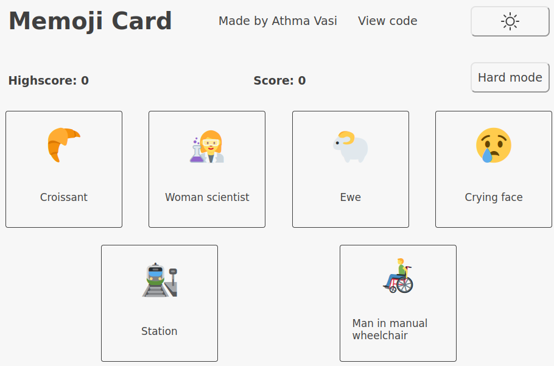
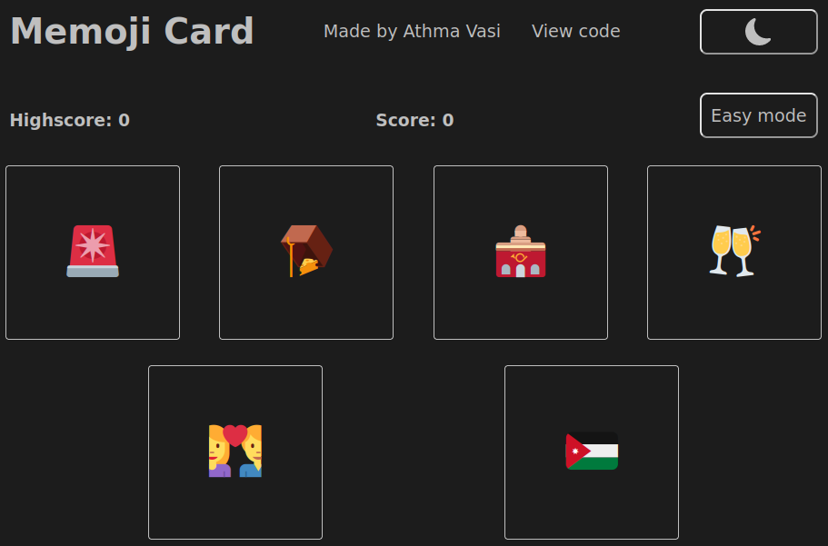
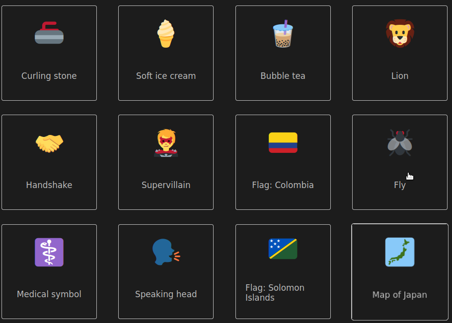

# Memoji Card Game

Introducing a new twist on the classic memory game: **Memoji Card**! An emoji-themed challenge that will put your skills to the test! In this game, players must carefully select a sequence of cards without clicking the same one twice.

You'll need to keep your wits about you to remember which cards you've already clicked and which ones are still in play. With each round, you'll be presented with a fresh set of cards and a new challenge to conquer.

If you're looking for a fun and challenging game that's sure to keep you entertained for hours, look no further than **Memoji Card**. With its addictive gameplay and colorful design, it's the perfect way to pass the time and flex your mental muscles at the same time. Give it a try today and see how far you can go!

[Click here to view project live](https://athma-vasi.github.io/Memoji-Card/)

#### March 23, 2023 Update

There are certainly many improvements that I can make, having improved my skills since I first built this project. For sentimental reasons, all modifications were designed to be as minimally disruptive to the original theme and presentation as possible, with the game logic remaining unchanged.

These are the changes I made:

- made it responsive
- modified jsx for better readability
- modified styled-components

#### Screenshots

  
  
  

## Things I learned

This project is designed to cement foundational React principles introduced in the CV-Application project.

#### Technologies used

- [React](https://react.dev/)
- [TypeScript](https://www.typescriptlang.org/)
- [Create React App](https://create-react-app.dev/)
- [Styled-Components](https://styled-components.com/)
- [Cypress](https://www.cypress.io/)

### TL;DR

- hooks
- useReducer

I initially used `useState` for local state management and `useReducer` at the app level. However, this created conflicts and I soon realized that any state update triggers a re-render, which was why my values were not being updated properly. Some of my functions were causing multiple re-renders!

So I removed the local `useState`s and made the `reducer` into the central repository of 'truth'. All state was modified at the component level and the `reducer` just replaces the current state with the new state, and passes the state down along with a `dispatch` callback. It became a pure function and was much easier to reason about.

Memory card project as part of The Odin Project curriculum

#### Disclaimer

The emojis used in this project were downloaded from [emoji-api.com](https://emoji-api.com/)
